# PyCardGolf


## Table of Contents
1. [Rules](#rules)
2. [Architecture](#architecture)
3. [Design](#design)
4. [Installation](#installation)
5. [Development](#development)
6. [Testing](#testing)

## Rules
PyCardGolf follows the standard [rules of Card Golf](src/pycardgolf/RULES.md).
The goal is to have the lowest score after a set number of rounds.

You can also view the rules directly in the CLI by running with the `--rules` flag:
```bash
poetry run pycardgolf --rules
```

## Architecture
PyCardGolf is built as an event-driven game engine that strictly decouples game logic from user interfaces.

### Core Components
- **Game Engine (`core/`)**: Manages rounds, player turns, and the state machine. It emits `GameEvent` objects and accepts `Action` objects.
- **Interfaces (`interfaces/`)**: Defines abstract base classes for rendering and input handling. This allows for terminal, GUI, or bot-driven interfaces.
- **Observation Layer**: Provides players with a sanitized view of the game state, ensuring that information (like face-down cards or opponent's private data) is only visible when it should be.

### System Overview

```mermaid
graph TB
    subgraph Core["core/ — Game Engine"]
        Game["Game"]
        EventBus["EventBus"]
        Observation["Observation"]

        subgraph StateMachine["Round State Machine"]
            Round["Round (Manager)"]
            Phases["Phases (Current State)"]
        end
    end

    subgraph Interfaces["interfaces/ — I/O"]
        GameRenderer["GameRenderer (ABC)"]
        GameInput["GameInput (ABC)"]
    end

    subgraph Players["players/ — Player Logic"]
        HumanPlayer["HumanPlayer"]
        RandomBot["RandomBot"]
    end

    %% Internal Engine Flow
    Game -- Starts & Manages --> Round
    Round -- Transitions through --> Phases
    Phases -- Updates State & Generates --> Observation

    %% Event-Driven Rendering
    Game -- Publishes Events --> EventBus
    EventBus -- Triggers --> GameRenderer

    %% Observation Flow (State to Players)
    Observation -- Sent to --> HumanPlayer
    Observation -- Sent to --> RandomBot

    %% Input Flow & Context Rendering
    HumanPlayer -- Prompts via --> GameInput
    GameInput -. Uses for prompt context .-> GameRenderer
    GameInput -- Returns Action --> HumanPlayer

    %% Decisions to Engine (Processed by Current Phase)
    HumanPlayer -- Sends Action to --> Phases
    RandomBot -- Sends Action to --> Phases
```


### Extensibility
The library is designed to be easily extended:
- **New Players**: Inherit from `BasePlayer` and implement `get_action(observation)`.
- **New Interfaces**: Implement `GameRenderer` (for output) and `GameInput` (for human-driven decisions).
- **Custom Bots**: Create a bot that analyzes the `Observation` to return the optimal `Action`.

## Playing the Game

### Prerequisites
- [Poetry](https://python-poetry.org/docs/) (>=2.2.1)
- [Python](https://www.python.org/downloads/) (3.13.x)

### Installation
Install the game without development dependencies:
```bash
poetry install --without dev
```

### Running the Game
Run a quick game with 1 human player, 1 bot, and 1 round:
```bash
poetry run pycardgolf --humans 1 --bots 1 --rounds 1
```

Customization options:
- `--humans N`: Number of human players (default: 1)
- `--bots N`: Number of bot players (default: 1)
- `--rounds N`: Number of rounds to play (default: 9)

Example (2 humans, 3 rounds):
```bash
poetry run pycardgolf --humans 2 --bots 0 --rounds 3
```

## Development Setup

We use a **Container-First** development workflow. This ensures a consistent environment for all developers and AI agents.

### 🐳 Recommended: VS Code Dev Containers
The fastest way to develop is using the VS Code **Dev Containers** extension.

1. **Prerequisites**: Install [Docker Desktop](https://www.docker.com/products/docker-desktop/) and the VS Code [Dev Containers extension](https://marketplace.visualstudio.com/items?itemName=ms-vscode-remote.remote-containers).
2. **Launch**: Open this repository in VS Code. When prompted with *"Reopen in Container"*, select **Yes**.
3. **Result**: Your terminal, debugger, and linting (Pyrefly/Ruff) will run inside the Linux container using the internal Python 3.13 interpreter.

*Note: There is currently (as of 2/23/2026) an issue with the VS Code Dev Container extension when used with Antigravity. Please manually build and start the container using `docker-compose up -d --build`, then you can access it in Antigravity by using `Reopen in Container`.

### 🛠️ Alternative: Manual Docker Setup
If you prefer using a different IDE or a raw terminal:

1. **Build and Start**:
   ```bash
   docker-compose up -d --build
   ```
2. **Access the Environment**:
   ```bash
   docker exec -it pycardgolf-dev-container bash
   ```
3. **Run Commands**:
   Once inside the container, use Poetry normally:
   ```bash
   poetry run pytest
   poetry run pycardgolf --humans 1
   ```

### ⚠️ Local Development (Not Recommended)
If you must develop natively without Docker:

1. **Prerequisites**: [Poetry](https://python-poetry.org/docs/) (>=2.2.1) and [Python](https://www.python.org/downloads/) (3.13.x).
2. **Install**: `poetry install`
3. **Note**: You may encounter pathing or binary issues if switching between local and containerized environments due to `.venv` conflicts.

## 🛠 Contributor Setup: SSH & Git

To push/pull from within the Dev Container, this project uses **SSH Agent Forwarding**. This allows the container to securely "borrow" your host machine's identity without copying private keys into the Docker image.

### 1. Ensure your SSH Agent is running
**Windows (PowerShell):**
```powershell
# Set the service to automatic and start it
Get-Service ssh-agent | Set-Service -StartupType Automatic
Start-Service ssh-agent

# Load your key into the agent
ssh-add ~/.ssh/id_ed25519  # Replace with your specific key path if different
```

### 2. Troubleshooting "Permission Denied (publickey)"
If running `ssh-add -l` inside the Antigravity/VS Code terminal returns "No such file or directory," the bridge between your host and the container is broken.

**Windows 10/11 Fix:**
Windows doesn't always set the `SSH_AUTH_SOCK` environment variable by default. You must set it on your **host machine** so the IDE knows where the "pipe" is located.

1. (Host) Run this in PowerShell as **Administrator**:
   ```powershell
   $env:SSH_AUTH_SOCK = [System.Environment]::GetEnvironmentVariable("SSH_AUTH_SOCK", "User")
   ```
2. (Host) Restart Docker Desktop and rebuild container.
3. (Host) **Restart your IDE completely** (ensure all background processes are killed).
4. (Container) Run `ssh-add -l` to verify your key is loaded.

---
*Note for Mac/Linux Users: This setup typically works out of the box as the `SSH_AUTH_SOCK` variable is natively defined.*

### Pre-commit Hooks
Install the pre-commit hooks to ensure code quality:
```bash
poetry run pre-commit install
```
Run manually:
```bash
poetry run pre-commit run --all-files
```

## Testing

### Running Tests
```bash
poetry run pytest
```

### Coverage Report
```bash
poetry run pytest --cov=pycardgolf --cov-report=term-missing --cov-branch
```

### Focused Testing
- **Unit tests only**: `poetry run pytest tests/unit`
- **Integration tests only**: `poetry run pytest tests/integration`
